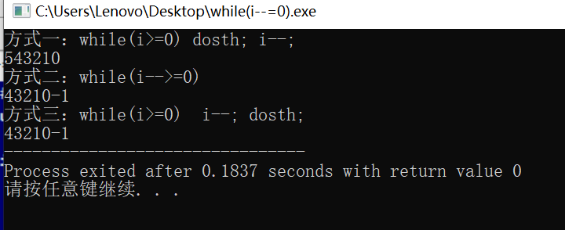

# 4_2 注意：while(i-- = 0)

```C++
#include<bits/stdc++.h>
using namespace std;

int main() {
	cout << "方式一：while(i>=0) dosth; i--;" << endl; 
	int i = 5;
	while(i>=0) {
		cout << i;
		i--;
	}
	
	//下面两种方式等价 
	cout << endl << "方式二：while(i-->=0)" << endl; 
	i=5;
	while(i-->=0)
		cout << i;
	
	cout << endl << "方式三：while(i>=0)  i--; dosth;" << endl; 
	i = 5;
	while(i>=0) {
		i--;
		cout << i;
	}
		
} 
```

