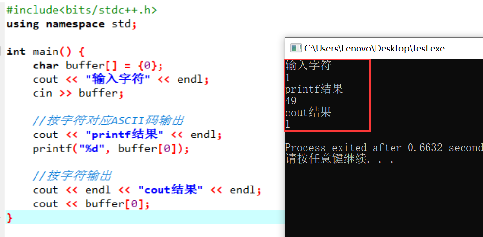

# 4_3 printf和cout输出char数组

```C++
#include<bits/stdc++.h>
using namespace std;

int main() {
	char buffer[] = {0};
	cout << "输入字符" << endl; 
	cin >> buffer;
	
	//按字符对应ASCII码输出 
	cout << "printf结果" << endl; 
	printf("%d", buffer[0]);
	
	//按字符输出 
	cout << endl << "cout结果" << endl; 
	cout << buffer[0]; 
} 
```

