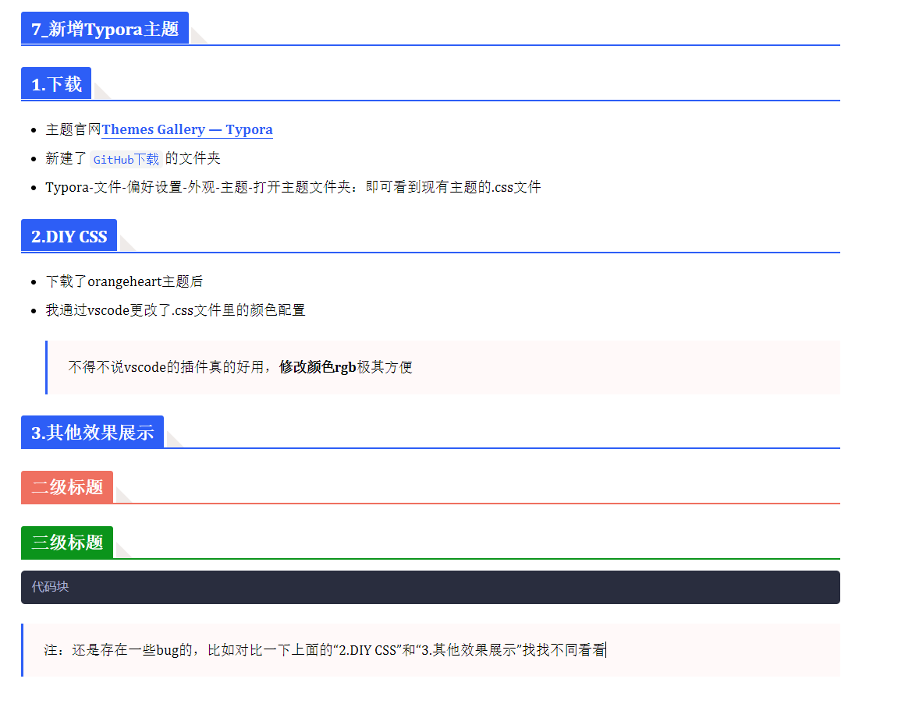

# 7_新增Typora主题

# 1.下载

- 主题官网[Themes Gallery — Typora](https://theme.typora.io/)
- 新建了`GitHub下载`的文件夹
- Typora-文件-偏好设置-外观-主题-打开主题文件夹：即可看到现有主题的.css文件

# 2.DIY CSS

- 下载了orangeheart主题后

- 我通过vscode更改了.css文件里的颜色配置

  > 不得不说vscode的插件真的好用，**修改颜色rgb**极其方便

# 3.其他效果展示

## 二级标题

### 三级标题

```
代码块
```

> 注：还是存在一些bug的，比如对比一下上面的“2.DIY CSS”和“3.其他效果展示”找找不同看看

# 4.截图

